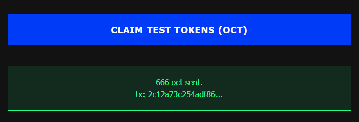

# Octra Wallet Generator
A secure wallet generator for Octra blockchain.
## Quick Start
### 1. Clone this repository
```bash
git clone https://github.com/kajijp/octra-wallet-generator.git
cd octra-wallet-generator
chmod +x wallet-generator.sh
```
### 2. Run the wallet generator webserver:
```
./wallet-generator.sh
```
### 3. Open your browser
- if you run on local PC :<br>
Navigate to http://localhost:8888 <br>
- if you run on vps :  
Navigate to http://<vps_ip_address>:8888

## Generating Wallets
1 . **Generate a wallet**: Click "**GENERATE NEW WALLET**" and watch the real-time progress  
2 . **Wallet features**:  
- View mnemonic phrase, private/public keys, and address
- Test signature functionality
- Derive addresses for different network types
- Auto-save wallet file to disk

## Get Faucet
Visit [Faucet page](https://faucet.octra.network/)
Enter your address starting with **oct**... to get faucet


## Configure Octra CLI and Wallet
### 1. Install Python
```
sudo apt install python3 python3-pip python3-venv python3-dev -y
```
### 2. Install Octra Client CLI
```
git clone https://github.com/octra-labs/octra_pre_client.git
cd octra_pre_client

python3 -m venv venv
source venv/bin/activate
pip install -r requirements.txt

cp wallet.json.example wallet.json
```
### 3. Add wallet to CLI
```
nano wallet.json
```
#### **Replace following values:**  
- private-key-here: Privatekey with B64 format  
- octxxxxxxxx...: Octra address starting with oct...  

### 4. Run Octra Client CLI
```
python3 -m venv venv
source venv/bin/activate
python3 cli.py
```
- This should open a Testnet UI

<br><br>
🔥 Mohon dukungan agar KajiJP semakin berkembang, like dan gabung ke channel kami, sebarkan dan undang teman anda, terima kasih, Insyaallah JP!
## 🌐 Komunitas KajiJP
Gabung dan ikuti info terbaru:
- 💬 [Telegram](https://t.me/kajijp)
- 🎮 [Facebook](https://facebook.com/kajijp)
- 🐦 [X / Twitter](https://x.com/wakkajijp)
- ▶️ [Youtube](https://youtu.be/aV0tCg9zqrw)

